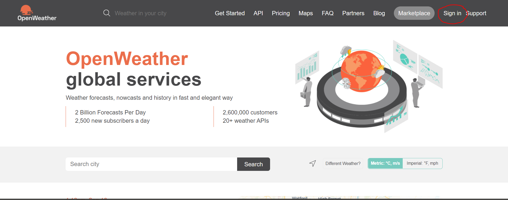
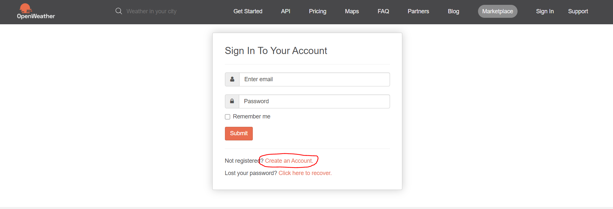
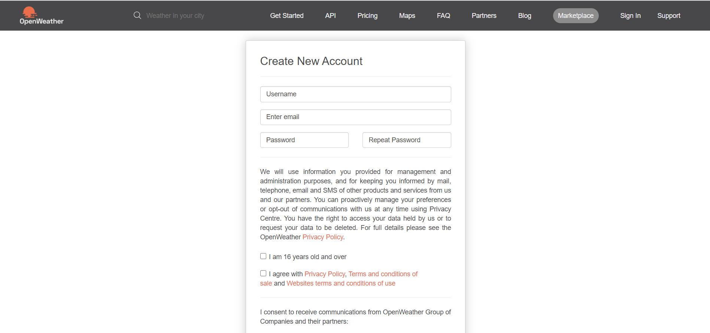
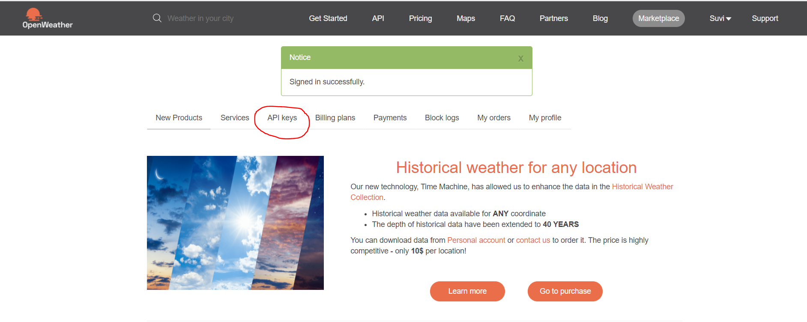
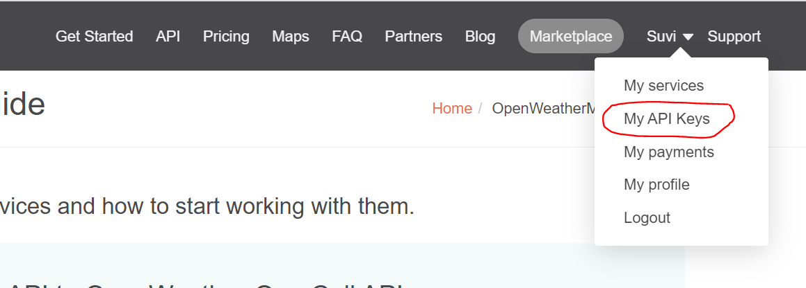

# Week 2.2 - Add Weather API 

In this lab we use Open Weather-website to get an Apikey and use it to fetch weatherdata from the Weather API to the console.

  - [Need to know](#need-to-know)
  - [How to get weather apikey](#how-to-get-weather-apikey)
  - [Fetching weather data](#fetching-weather-data)
  - [Selecting specific data](#selecting-specific-data)
  - [Summary](#summary)
  
## Need to know

API key: A code used to identify user. Gives a set of access rights for the API. More information: [RapidAPI Blog](https://rapidapi.com/blog/api-glossary/api-key/)  

## How to get weather apikey

In order to get weather information through the OpenWeather api, you need an Apikey to authorize the request you make in your application. We will be using the free version of OpenWeatherMap in this application. You do not need to give payment information anywhere. Note that it can take up to 2 hour to activate your API key, so do this first.  

Instructions:
Go to https://openweathermap.org/ and click sign in  

  

Create an Account  
  
  
When you sign in and see the home page, you can just click the api keys tab to get your api key
  
Alternatively if you are not in the home page view, you can click on your name at the top right of the screen and select “My API keys”
  

When fetching the current weather, use https://api.openweathermap.org/data/2.5/weather?q=Helsinki,fi&units=metric&&APPID=YOURAPIKEY URL.
Forecast can be fetched from https://api.openweathermap.org/data/2.5/forecast?q=Helsinki&units=metric&&appid=YOURAPIKEY  
Remember to replace YOURAPIKEY with your apikey.  
More on getting weather data:  
https://openweathermap.org/current  
https://openweathermap.org/forecast5  

## Fetching weather data

After getting the Apikey, you can now use it to get weather information in the console similarly to Week 2.1.
You can use the same exact code that was used to get Outdoor routes data. Just replace the url with https://api.openweathermap.org/data/2.5/weather?q=Helsinki,fi&units=metric&&APPID=YOURAPIKEY for current weather or with https://api.openweathermap.org/data/2.5/forecast?q=Helsinki&units=metric&&appid=YOURAPIKEY for forecast. You can also experiment trying the weather of different cities by substituting "Helsinki" from the url with another city.  
```html
<script>
fetch("https://api.openweathermap.org/data/2.5/weather?q=Helsinki,fi&units=metric&&APPID=YOURAPIKEY") 
    .then((response) => { 
        return response.json(); 
    })
    .then((natureJson) => { 
        console.log(natureJson); 
        });
</script>
```
- Remember to ``Commit`` and ``Push`` changes to **Git**. Go to **Console**

**Congratulations, you have fecth weather data to your application on IBM Cloud™!** :clap:


## Selecting specific data

For our application we need data from current weather and weather forecast from 2 days. For this we need two seperate fetch function.

### Current weather
Here is an example how to get the name of the city you are fetching weather for, description of the weather, temperature and icon. At this point the icon is only a combination of three letters and numbers. Printing the actual icon to the page is covered in a later week.   
```html
<script>
    fetch("https://api.openweathermap.org/data/2.5/weather?q=Helsinki,fi&units=metric&&APPID=YOURAPIKEY")
        .then((response) => { 
            return response.json(); 
        })
		.then((weatherJson) => { 
			console.log(weatherJson); 
                	var cityName = weatherJson.name; 
                	var weatherDescription = weatherJson.weather[0].description;
                	var temperature = weatherJson.main.temp;
                	var icon = weatherJson.weather[0].icon;
               		console.log("Name of the city: " + cityName);
                	console.log("Weather description: " + weatherDescription);
                	console.log("Temperature: " + temperature + "°C");
                	console.log("Icon for weather: " + icon);
            	});
</script>
```
### Weather forecast

Selecting specific data from forecast is a bit more complicated, since the data is in a list and requires a loop and if-statements to get what you want.
Basically in the following code a loop goes through the entire list and if-statements are used to get the desired information from that list. We will not go through loops and if-statements more in depth here, but more information on loops can be found [here](https://www.w3schools.com/js/js_loop_for.asp) and more on if-statements [here](https://www.w3schools.com/js/js_if_else.asp). There are however some comments in the code to explain it a bit. The comments start with //, which is how you mark a single-line comment in javascript. 

```html
<script>
fetch("https://api.openweathermap.org/data/2.5/forecast?q=Helsinki&units=metric&&appid=YOURAPIKEY")
	.then((response) => { 
		return response.json(); 
	})
	.then((weatherJson) => {
		console.log(weatherJson);
		var count = 0;
		for(var i = 0; i < weatherJson.list.length; i++) { //Loop for going through the results for the forecast
			var time = weatherJson.list[i].dt_txt;	//eg. "2020-10-09 15:00:00"
			var hour = time.slice(11, 16);		//Separating the hour from time
			var date = time.slice(0, 10);		//Separating the date from time
			if(hour === "12:00"){			//If the hour is 12, data is stored to variables and then printed to console
				var description= weatherJson.list[i].weather[0].description;
				var temperature= weatherJson.list[i].main.temp + "°C";
				console.log(date + " " + hour + " " + description + " " + temperature);
				count++;
				if(count === 2){ 	//Once you have printed to console twice, you can stop the loop with break-statement. You can change the number depending on how many results you want. Five, however is the maximum amount of result you can get, since the API provides forecast for only five days
					break;
				}
		}
	}
}); 
</script>
```

## Summary

Great! You are now done with Week 2!

You have now got weather data to your Application from an API.

You can now move on to learning how to add stuff to your actual webpage in [Week 3.1. - Set webpae layout](https://github.com/jenni-hautojarvi/cloud-rock-star-2020/tree/master/Week%203.1%20-%20Set%20webpage%20layout) 
