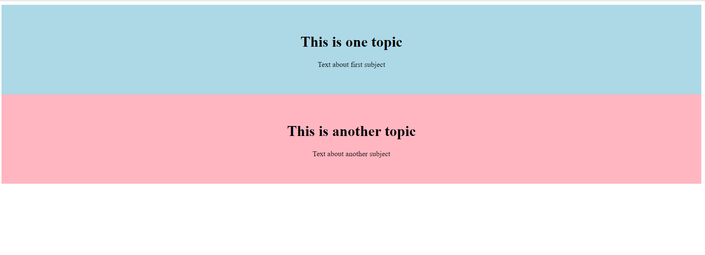

# Week 3.2 - Set application layout 

In this lab we go through some body element layout basics and start creating the application to be visible on the page

  - [Need to know](#need-to-know)
  - [Basic HTML layout](#basic-html-layout)
  - [Summary](#summary)
  
## Need to know
**HTML**: Stand for **H**yper **T**ext **M**arkup **L**anguage and it is startand markup language for creating Web pages. It contains different elements, example ``html``,``head``,``body``, ``script``, etc.

**HTML element**: Tells to the browser how to display the content. Usually elements has a ending tag example ``</h1>``. But example ``<br>`` does not (it is for empty row). 


## Basic HTML layout
**Note:** You can try modifying the code in your application as we go through the basics.

We need areas where we print:
- Current weather data
- Weather forecast
- List of places
- Map

Don't worry, we will cover everything for this in next chapter. Now we just want you to try and see how you can modify html page layout. So don't panic :wink:

**1. HTML page stucture**

HTML is used to desrcibe the structure of the page. 
A very basic html document contains the following structure:  
```html
<!DOCTYPE html> <!-- defines that this document is an HTML5 document-->
<html> <!-- root element for an HTML page -->
<head> <!-- contains meta information about the HTML page -->
<title>Page Title</title> <!-- title for the HTML page which you can see in the browser page's tab-->
</head>
<body> <!-- defines the document body and contains all the visible contents example tables, images, etc. -->

<h1>This is a Heading</h1> <!-- lage heading -->
<p>This is a paragraph.</p> <!-- paragraph -->

</body>
</html>
````
**Read more:** A good place to read more is visit [w3schools](https://www.w3schools.com/html/html_intro.asp) pages.

**2. Div-tag**

An html-document often contains a lot of code, so it is useful to divide content into sections with div-tag. This is helpful for clarifying different contents but also with styling the sections.
Here is an example of code with only on div:
```html
<!DOCTYPE html>
<html>
<head>
<title>Page Title</title>
</head>
<body>

<div id="one-section">
<h1>This is one topic</h1>
<p>Text about first subject</p>

<h1>This is another topic</h1>
<p>Text about another subject</p>
</div>

</body>
</html>
```

An example with two divs:
```html
<!DOCTYPE html>
<html>
<head>
<title>Page Title</title>
</head>
<body>

<div id="first-section">
  <h1>This is one topic</h1>
  <p>Text about first subject</p>
</div>

<div id="second-section">
  <h1>This is another topic</h1>
  <p>Text about another subject</p>
</div>

</body>
</html>
```
**Note** that the div-structure goes:  
```html
<div>
    content
</div>
```
Giving the div-tag an unique ``id`` helps pointing, for example, styles to the specific section.
Example:  
```html
<!DOCTYPE html>
<html>
<head>
<title>Page Title</title>
<style>
#first-section {
  background-color: lightblue;
  color: black;
  padding: 40px;
  text-align: center;
}
#second-section {
  background-color: lightpink;
  color: black;
  padding: 40px;
  text-align: center;
}
</style>
</head>
<body>

<div id="first-section">
  <h1>This is one topic</h1>
  <p>Text about first subject</p>
</div>

<div id="second-section">
  <h1>This is another topic</h1>
  <p>Text about another subject</p>
</div>

</body>
</html>
```
The previous code results:  
  

Feel free to experiment with the styles.   

**Note** that to refrence an ``id`` in the style sections, you need a ``#`` in front of the id.  
If you want to use the same style for different elements (eg. div, h1, p), you can give it a class:

```html
<div class="blue-div">
  <p>Content</p>
<div>
<div id="pink-div">
  <p>Content</p>
<div>
<div class="blue-div">
  <p>Content</p>
<div>
```
Referencing a class in style-section happens with a ``.`` instead of ``#``:
```CSS
<style>
.blue-div { /* This is how you comment CSS code */
  background-color: lightblue;
  color: black;
  padding: 40px;
  text-align: center;
}
#pink-div {
  background-color: lightpink;
  color: black;
  padding: 40px;
  text-align: center;
}
```
There are multiple reasons to use ``id``and ``class``. For example next chapter we will use functionality where we call div-tag with specific ``id``to modify that section. When you choose the name for the ``id``or ``class``remember to use as a name that describes the area. This is for the screen readers.

**3. Columns**

You might have noticed that HTML code stacks content in rows on the web pages. There is a way to have dived the row into columns and have different content inside.
Let's use same example that we already have but let's add ``div``with ``class ="row"`` and add ``class="column"`` to others. And yes, you can have ``id``and ``class``in same ``div`` :smile:

```html
<!DOCTYPE html>
<html>
<head>
<title>Page Title</title>
<style>
#first-section {
  background-color: lightblue;
  color: black;
  padding: 40px;
  text-align: center;
}
#second-section {
  background-color: lightpink;
  color: black;
  padding: 40px;
  text-align: center;
}
    
/*style to dived div in to columns*/
* {
  box-sizing: border-box;
}

/* Create two equal columns that floats next to each other */
.column {
  float: left;
  width: 50%;
  padding: 10px;
}

/* Clear floats after the columns */
.row:after {
  content: "";
  display: table;
  clear: both;
}
    
</style>
</head>
<body>

<div class="row"> <!-- added -->
    <div id="first-section" class="column">
      <h1>This is one topic</h1>
      <p>Text about first subject</p>
    </div>

    <div id="second-section" class="column">
      <h1>This is another topic</h1>
      <p>Text about another subject</p>
    </div>
</div>

</body>
</html>
```
Results for this code:

 

**Read more:** [w3school - Grid](https://www.w3schools.com/howto/howto_css_two_columns.asp)

## Summary

We have now cover basic for HTML page elements and you are ready to try design your application layout. Good job! :sunglasses:

Next week we will cover styles and add functionality to your application :smile: