# Week 4.1 - Modify your application style

In week 3.2 you learned some basics about html and very briefly about styles. This week we will learn more about style.

  - [Need to know](#need-to-know)
  - [CSS](#css)
  - [Bootstrap](#bootstrap)
  - [Bootstrap container and grid](#bootstrap-container-and-grid)
  - [Bootstrap buttons](#bootstrap-buttons)
  - [Example application layout](#example-layout)
  - [Summary](#summary)
  

## Need to know

**CSS**: CSS (Cascading Style Sheet) is a language used to style web pages. [Read more w3school CSS](https://www.w3schools.com/css/)

**Bootstrap**: Bootstrap is a CSS framework that is designed for responsive mobile-first front-end web development. It has HTML and CSS based design templates and optional JavaScript plugins. [Read more w3school Bootrsrap](https://www.w3schools.com/bootstrap/default.asp)

**Responsive Web design**: Responsive web design means that a website is designed so that it works and looks good on all devices regarless their size. 

## CSS

In previous week we experimented with styles by referencing element id's or classes in the style section inside head section.

Example with simple ``html`` layout, where text ``"Hello World!"`` inside p-tags is styled red:

```html
<!DOCTYPE html>
<html>
<head>
<title>Page Title</title>
<style>
  #hello {
    color: red;
  }
</style>
</head>
<body>
  <p id="hello">Hello World!</p>
</body>
</html>
```

This type of styling is called internal ``CSS``, because the style is defined directly in the ``html`` document. 
Another way of using styles is external ``CSS`` in which we make a separate file containing ``CSS`` and link to it in the html-file. The advantage of this is that we can have all the css in one file and just link it to all the needed html pages.

As an example we can have a file called inde.html and have it contain the following:

```HTML
<!DOCTYPE html>
<html>
<head>
    <title>Hello world</title>
    <link rel="stylesheet" href="styles.css"/> 
</head>
<body>
    <h1 id="hello">Hello World!</h1>
    <p class="text">Lorem ipsum dolor sit amet, consectetur adipiscing elit, sed do eiusmod tempor incididunt ut labore et dolore magna aliqua.</p>
</body>
</html>
```

So we have a basic html layout, but instead of style-tags we have used a link-tag to link to the file where the style is. Href inside link-tag is used to specify the location of stylesheet.
Then inside the styles.css-file we use can use id's, classes or even an element tag like "body" directly to define styles:

```CSS
body {
    background-color: lightblue;
}
#hello {
    color: red;
}
.text {
    font-style: italic;
}
```

The previous code results to this:  
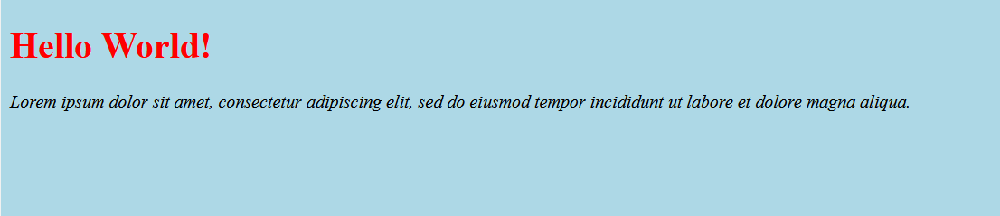  

An image can also be used as a background. Just replace the ``background-color: lightblue;`` inside body in css with ``background-image: url(https://i.pinimg.com/originals/ce/7f/55/ce7f55d0ce9ec88c238f4f0f5731d809.jpg);`` and instead of a lightblue background there is now an image. The url can be changed to use any picture you like.  

Now if we want more space around an element, we can use padding.
For example if we want the heading and the text in the previous example to have more space around it, we can create a div that is given padding:

```html
    <div id="divWithPadding">
        <h1 id="hello">Hello World!</h1>
        <p class="text">Lorem ipsum dolor sit amet, consectetur adipiscing elit, sed do eiusmod tempor incididunt ut labore et dolore magna aliqua.</p>
    </div>
```

And in the stylesheet add:

```css
#divWithPadding {
    padding: 50px;
}
```
Now the div-element and everything inside it will be moved to have 50 pixels of space around it:  
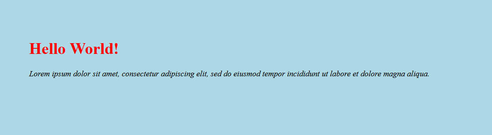  

You can change the padding to be any size you want. You can also add padding to just one side of the element by using padding-top, padding-right, padding-bottom and padding-left.

## Bootstrap

Bootstrap is an easy way to style your application. To use bootstrap you can either download it from getbootstrap.com or add the stylesheet and the required javascript files to the head-section of the page.
Here we will be adding the required files to the head-section.

```html
<head>
  <link rel="stylesheet" href="https://maxcdn.bootstrapcdn.com/bootstrap/4.5.2/css/bootstrap.min.css">
  <script src="https://ajax.googleapis.com/ajax/libs/jquery/3.5.1/jquery.min.js"></script>
  <script src="https://cdnjs.cloudflare.com/ajax/libs/popper.js/1.16.0/umd/popper.min.js"></script>
  <script src="https://maxcdn.bootstrapcdn.com/bootstrap/4.5.2/js/bootstrap.min.js"></script>
</head>
```
As we defined styles in our styles.css, the bootstrap stylesheet contains pre-made styles that are easy to use and are designed to be responsive.
There should also be a meta-tag inside head-element for rendering.  

```html
<meta name="viewport" content="width=device-width, initial-scale=1"> 
```  
The width=device-width renders the page to match the width of the device. initial-scale=1 is the initial zoom level of the page.

## Bootstrap container and grid
There are many things that can be done with bootstrap, but we can start with container. A div can be given class="container" so that everything inside that div is within that container. For example:

```html
<!DOCTYPE html>
<html>
<head>
<title>Page Title</title>
    <meta name="viewport" content="width=device-width, initial-scale=1">
    <link rel="stylesheet" href="https://cdnjs.cloudflare.com/ajax/libs/leaflet/1.6.0/leaflet.css" integrity="sha512-xwE/Az9zrjBIphAcBb3F6JVqxf46+CDLwfLMHloNu6KEQCAWi6HcDUbeOfBIptF7tcCzusKFjFw2yuvEpDL9wQ==" crossorigin="anonymous" />
      <!-- jQuery library -->
    <script type="text/javascript" src="https://ajax.googleapis.com/ajax/libs/jquery/2.0.0/jquery.min.js"></script>
    <link rel="stylesheet" href="https://maxcdn.bootstrapcdn.com/bootstrap/4.4.1/css/bootstrap.min.css">
    <script src="https://maxcdn.bootstrapcdn.com/bootstrap/4.5.2/js/bootstrap.min.js"></script>
<style>
    .container{
        background-color: lightblue;
    }
</style>
</head>
<body>
    <div class="container">
 	      <h1 class="">Header</h1>
        <p>Lorem ipsum dolor sit amet, consectetur adipiscing elit, sed do eiusmod tempor incididunt ut labore et dolore magna aliqua. Ut enim ad minim veniam, quis nostrud             exercitation ullamco laboris nisi ut aliquip ex ea commodo consequat. Duis aute irure dolor in reprehenderit in voluptate velit esse cillum dolore eu fugiat nulla               pariatur. Excepteur sint occaecat cupidatat non proident, sunt in culpa qui officia deserunt mollit anim id est laborum.</p>
    </div>
</body>
</html>
```

Here we have given a div the class container and also made the background of the container lightblue, so that we can see where the container is in the page.  

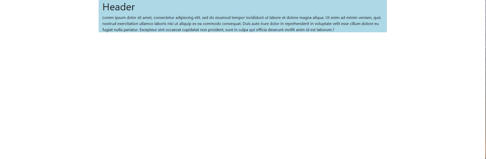

Without a container the text starts from the very left of the screen.  

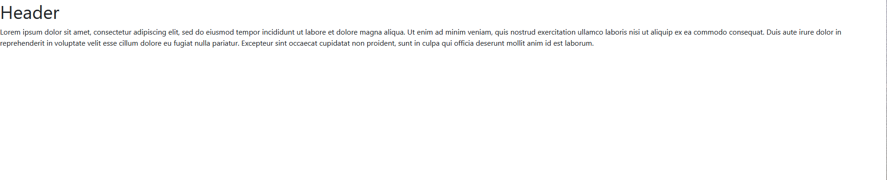 

If you want a container that is the width of the entire screen, you can use container-fluid class. 


When we want to divide the page vertically into sections, we can use Boostraps Grid system, which allows us to have up to 12 columns across the width of the page.  
As an example, if we want to have three columns in the page, we first need a div="row" inside which we put three divs with class="col"

```html
<div class="container">
 	<h1>Header</h1>
    <div class="row">
        <div class="col" id="first"><p>First column</p></div>
        <div class="col" id="second"><p>Second column</p></div>
        <div class="col" id="third"><p>Third column</p></div>
    </div>
</div>
```
Result:  
   
If we want two columns with one bigger than the other:  

```html
<div class="container">
 	<h1>Header</h1>
    <div class="row">
        <div class="col-sm-4"><p>First smaller column</p></div>
        <div class="col-sm-8"><p>Second bigger column</p></div>
    </div>
</div>
```

Result: 

  
With grids if you resize the screen, you should see the columns resize and move with the screen.  
More on different options can be read on [getbootstrap.com](https://getbootstrap.com/docs/4.0/layout/grid/)  

## Bootstrap buttons

An easy thing to style with Bootstrap is buttons. We can give a button a class and it changes for example color and size accordingly. Also when you hover over a button on your page with you cursor, the color of the button changes.  

```html
<div class="container">
  <br>
  <button class="btn btn-info">Button 1</button>  
  <button class="btn btn-outline-success">Button 2</button> 
  <button class="btn btn-light btn-lg">Button 3</button> 
  <br><br>
</div>
```
Result:  
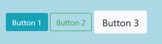  
Clicking these buttons, won't do anything yet. Giving them functions, will be covered in week 4.2.  

More on styling buttons with Bootstrap can be read on [W3Schools](https://www.w3schools.com/bootstrap4/bootstrap_buttons.asp) for example.  

Bootstrap can also be used for many other things like navigation, images, slideshow carousels, forms etc. 
If you are interested in these go to [getbootstrap.com](https://getbootstrap.com/docs/4.0/getting-started/introduction/) and [W3Schools](https://www.w3schools.com/bootstrap4/default.asp), where you can learn much more. Both have a lot of information, if you go through the side navigation.  

## Example application layout

You may now have made your own application layout and thats okay. But here is a example how to start :blush:

So at this point your html code should look like [this.](https://github.com/jenni-hautojarvi/cloud-rock-star-2020/blob/master/images/example_codes/map.html)


1. Add in header part needed bootstrap files

```html
<!-- bootstrap -->
  	<link rel="stylesheet" href="https://maxcdn.bootstrapcdn.com/bootstrap/4.5.2/css/bootstrap.min.css">
	<script src="https://ajax.googleapis.com/ajax/libs/jquery/3.5.1/jquery.min.js"></script>
	<script src="https://cdnjs.cloudflare.com/ajax/libs/popper.js/1.16.0/umd/popper.min.js"></script>
	<script src="https://maxcdn.bootstrapcdn.com/bootstrap/4.5.2/js/bootstrap.min.js"></script>
````
**Like this:**
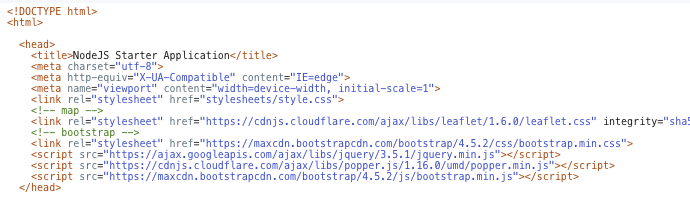 

2. Let's wrap our application UI content indside the container for bootstrap. In here I have wrote Map inside ``<div>`` element. The JavaScript functions overwrites this **Map** word when printing the map :smile:

```html
<div class="container">
    <div id="currentWeather"></div>
	<div id="futureWeather"></div>
	<div id=list_outdoor></div>
	<div id="mapid">Map</div>
    <script src="https://cdnjs.cloudflare.com/ajax/libs/leaflet/1.6.0/leaflet.js" integrity="sha512-gZwIG9x3wUXg2hdXF6+rVkLF/0Vi9U8D2Ntg4Ga5I5BZpVkVxlJWbSQtXPSiUTtC0TjtGOmxa1AJPuV0CPthew==" crossorigin="anonymous"></script>
</div>
```

3. Let's divide weather, list of places and map in seperated columns and rows :blush:

```html
<div class="container">
    <!--weather -->
    <div class="row" id="weather">
 		<div class="col-sm-4">
            <div class="row" id="currentWeather"></div>
        </div>
        <div class="col-sm-8">
	       <div class="row" id="futureWeather"></div>
        </div>
    </div>
    <!-- outdoor-->
    <div class="row" id="outdoor">
        <div class="col-sm-4">
	       <div id=list_outdoor></div>
        </div>
        <div class="col-sm-8">
	       <div id="mapid">Map</div>
        </div>
    <script src="https://cdnjs.cloudflare.com/ajax/libs/leaflet/1.6.0/leaflet.js" integrity="sha512-gZwIG9x3wUXg2hdXF6+rVkLF/0Vi9U8D2Ntg4Ga5I5BZpVkVxlJWbSQtXPSiUTtC0TjtGOmxa1AJPuV0CPthew==" crossorigin="anonymous"></script>
    </div>
</div>
```

Go to **Git** ``Commit`` and ``Push``. Wait delivery pipeline and..

**Now your application should look like this**  :smile: 
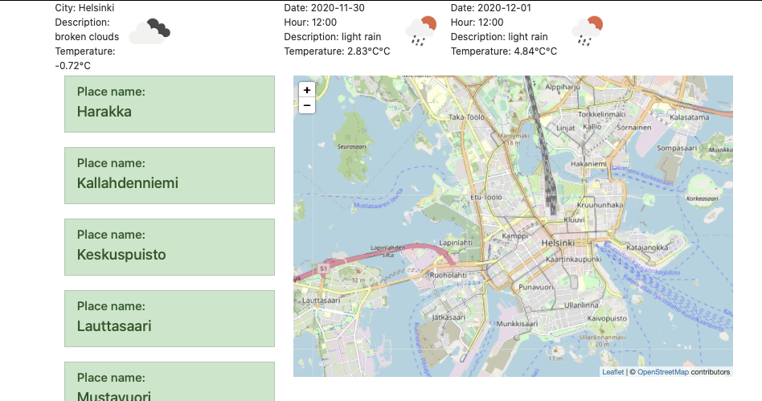 

4. Let's go and change the Javascript part where we print the forecast part in application and add class='col' in there also for the images to have spaces.

You should have it in line 106.

```html
<script>
weatherArray += "<div>Date: " + date + "<br>Hour: " +hour + "<br>Description: " + description + "<br>Temperature: " + temperature + "<br>" + "</div><div></img><br><br></div>";
</script>
```

Let's add ``class='col'`` in every ``<div>`` element in ``weatherArray`` variable. Like this:

```html
<script>
weatherArray += "<div class='col'>Date: " + date + "<br>Hour: " +hour + "<br>Description: " + description + "<br>Temperature: " + temperature + "<br>" + "</div><div class='col'></img><br><br></div>";
</script>
```
Do the same with current weather script, add ``class='col'`` in every ``<div>`` element

```html
<script>
currWeather.innerHTML = "<div class='col'>City: " + cityName + "<br>Description: <br>" + weatherDescription + "<br>Temperature: <br>" + temperature +"°C <br>" + 
			    "</div><div class='col'></img></div>";
</script>
```

**Now your application should look like this**  :smile: 

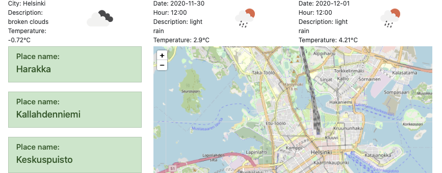 

5. Next add headers :smile:

Here are examples, but you can choose your hearders as you wish :blush:

```html
<div class="container">
    <h1 class="mainTitle text-center">Helsinki Outdoor recreation app</h1>
    <!--weather -->
    <div class="row" id="weather">
 		<div class="col-sm-4">
            <h3>Current weather in Helsinki</h3>
            <div class="row" id="currentWeather"></div>
        </div>
        <div class="col-sm-8">
           <h3>Forecast for Helsinki</h3>
	       <div class="row" id="futureWeather"></div>
        </div>
    </div>
    <!-- outdoor-->
    <div class="row" id="outdoor">
        <div class="col-sm-4">
            <h3>Outdoor locations</h3>
            <div id=list_outdoor></div>
        </div>
        <div class="col-sm-8">
            <h3>Helsinki map</h3>
            <div id="mapid">Map</div>
        </div>
    <script src="https://cdnjs.cloudflare.com/ajax/libs/leaflet/1.6.0/leaflet.js" integrity="sha512-gZwIG9x3wUXg2hdXF6+rVkLF/0Vi9U8D2Ntg4Ga5I5BZpVkVxlJWbSQtXPSiUTtC0TjtGOmxa1AJPuV0CPthew==" crossorigin="anonymous"></script>
    </div>
</div>
```

**Now your application should look like this**  :clap: 

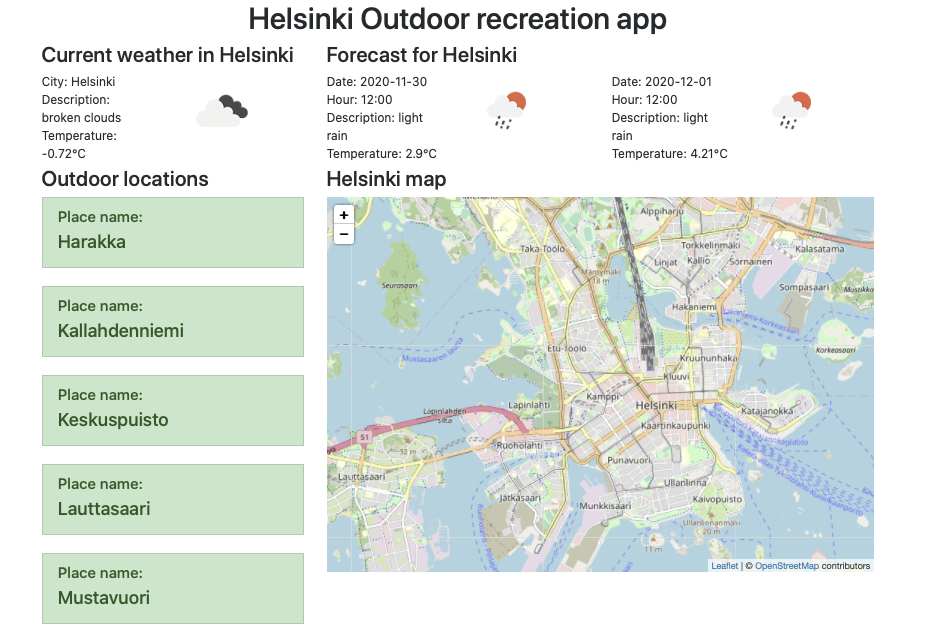 

6. Next modify your application CSS file for background color/image :raised_hands:

- Open ``stylesheets`` folder from left by cliking it (It's just above index.html file)
- Open ``style.css`` file
- Let's clear everything from it except the ``#mapid`` part
- Here is our new CSS file: (This is all that we need when using bootstrap :smile:)

```css

#mapid { 
    height: 500px; 
}

body{
     background-image: url(https://i.pinimg.com/originals/ce/7f/55/ce7f55d0ce9ec88c238f4f0f5731d809.jpg);
     background-repeat: no-repeat;
  	 background-size: cover;
}
        

* {
   box-sizing: border-box;
}

#list_outdoor{
    max-height: 500px;
    margin-bottom: 10px;
    overflow-y:scroll;   
    -webkit-overflow-scrolling: touch;
    }
        
#weather{
    background-color: skyblue;
    padding: 15px 0px 15px 0px;
}
        
.container{
    background-color: rgba(192,192,192,0.65); /* first three are for the color and the last one is the transparensy*/
    padding: 25px;        
 }
        
 #list_outdoor{
    background-color: rgba(192,192,192,0.8);
    padding: 5px;
  }

````

**Now your application should look like this. Good Job!**  :clap: 

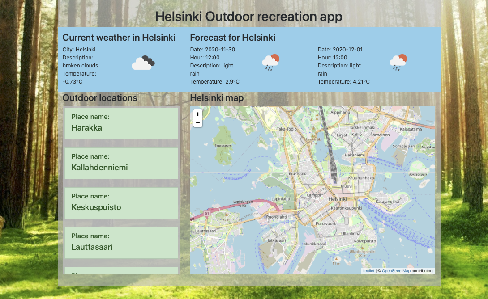 

:bulb: Your HTML code should look like [this](https://github.com/jenni-hautojarvi/cloud-rock-star-2020/blob/master/images/example_codes/index_css.html)

7. Add buttons

Firts add buttons in outdoors area list by adding two buttons. One is for visiting the place homepages and one is for showing it on the map :sunglasses: (Function for the buttons will be added in next chapter)

7.1 Go to ``index.html`` part where your print data to your application using variable called ``outdoor_list`` and modify it like this

```html
<script>
outdoor_list += '<li class="list-group-item list-group-item-action list-group-item-success"> <h5>Place name:</h5><h4>' + natureJson[i].title +'</h4> <button type="button" class="btn btn-info">Homepage</button> <button type="button" class="btn btn-info">Show on map</button></li>  <br>';
</script>

```

7.2 Forecast buttons

Go to ``<div>`` part where you print forecast data and add under header **Forecast for Helsinki** three buttons like this:

```html
<div class="col-sm-8">
		   	<h3>Forecast for Helsinki</h3>
		   	<!--These buttons allow time change -->
		   	<button class="btn btn-info">12:00</button>
		   	<button class="btn btn-info">15:00</button>
		   	<button class="btn btn-info">18:00</button>
		   	<br> <!-- you can add empty rows if you want -->
            <br>
            <!--Weather forecast is shown here -->
		   	<div class="row" id="futureWeather"></div>
	   	</div>
```

Now you have buttons in your applications! Nice work! :smile:

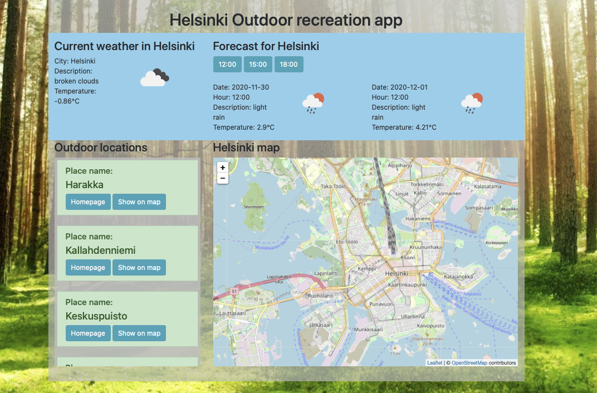


:bulb: Your HTML code should looks like [this](https://github.com/jenni-hautojarvi/cloud-rock-star-2020/blob/master/images/example_codes/application_with_buttons.html)


## Summary

 Great! You are done with week 4.1. You now know more about CSS and how to use bootstrap to style your application. 

You can move on to week 4.2 to add functionality to you application buttons and finish your application.
